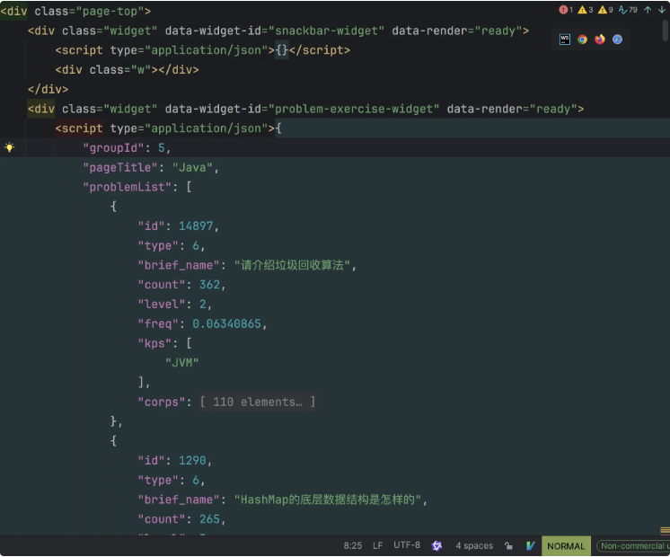
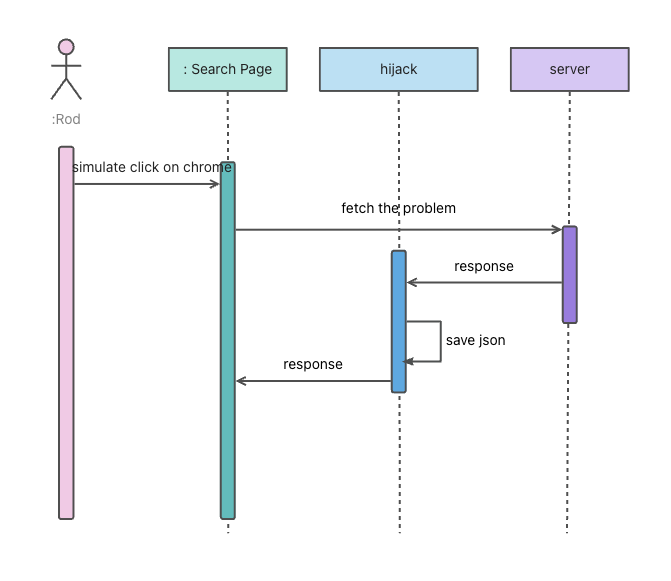

# 爬虫项目说明

## 爬取内容
- 前端八股文
- 后端八股文
- 人工智能八股文
- 云原生八股文
- HR 面八股文

## 技术栈
- **编程语言**: Go
- **爬虫框架**: colly

## 页面的观察
- 观察到 problemList
    - 可以根据 problemList 中的 id 对题目进行爬取
      

## 爬取流程（colly）
1. **初始化配置**：预设爬取目标类型及URL
    - Java
    - Go：https://www.xxx.com/problem-exercise/23?pid=44029
2. **页面解析**：获取题目列表
    - 通过data-widget-id="problem-exercise-widget"定位目标DOM
    - 反序列化JSON数据得到problemList
    - 创建本地文件：$pageTitle.txt
3. **内容爬取**：获取题目详情
    - 遍历problemList，筛选corps不为空的题目
    - 构造API请求：https://www.xxx.com/api/problems/$id?groupId=$groupId
    - 请求头需包含Cookie信息

## 爬取思路（Rod）
